<div align="center">


<a href="https://flo-os.de"></a>


<a href="https://github.com/Nuklaso/2048byNiklas"></a>


</div>



<table>
<tr>
<td width="33%" valign="top">

**`now`**

Three things at once: an atomic Linux distribution, a kernel that starts at the boot sector, and game systems that real players are logged into.

</td>
<td width="33%" valign="top">

**`why`**

The distro taught me what an operating system has to *promise*. The kernel is me finding out what it costs to keep that promise from nothing.

</td>
<td width="33%" valign="top">

**`ask me about`**

Why an update should be a snapshot and not a patch, what actually happens between the BIOS and `_start`, and why the GUI is still the hardest part.

</td>
</tr>
</table>


> **[flo-os.de](https://flo-os.de)** — FLOS is a gaming-ready, atomic KDE Plasma Wayland distribution built on Arch.
> Every update lands in a fresh Btrfs snapshot and only becomes the boot target once it completes, so an interrupted
> update changes nothing and a bad one costs you one reboot. Steam, gamescope, GameMode and MangoHud ship in the image;
> full-disk encryption, AppArmor and signed everything are the default, not a checkbox.
>
> It has not booted yet, and the site says so on its own front page — the numbers on the card above are copied from it.
> Shipping a status page that admits `0 ISO images` is a better engineering signal than a screenshot of a desktop.



> **That board is not a mockup.** It is a real game, replayed frame by frame.
> [`render_game.py`](.github/scripts/render_game.py) downloads [`engine.py`](https://github.com/Nuklaso/2048byNiklas/blob/main/engine.py)
> straight from the project, plays a full headless game with seed `11`, and freezes every
> board state into the SVG above. That run ended on **2,633 moves, 57,920 points and a 4096 tile** —
> in plain CPython, with nothing imported that does not ship with the language.

```bash
python .github/scripts/render_game.py --seed 11    # play a new game, redraw the card
```



| | PROJECT | WHAT IT DOES | STACK |
|:--|:--|:--|:--|
| `▸` | **[FLOS](https://flo-os.de)** | Atomic Arch distribution. Btrfs snapshot deployments, signed unified kernel images, Secure Boot, rollback to any of the last five deployments. Pre-release. | `Arch` `Btrfs` `KDE` |
| `▸` | **the kernel** | x86_64 from the boot sector up, in C and assembly. The bootloader hands control to the kernel entry; everything after that is the roadmap. | `C` `x86_64 ASM` `QEMU` |
| `▸` | **[2048byNiklas](https://github.com/Nuklaso/2048byNiklas)** | 2048 with an expectimax AI on a 64-bit bitboard. Precomputed move tables for all 65,536 rows, transposition table, probability-cutoff pruning, adaptive depth, plus a headless simulator and a self-test against a naive reference. | `Python` `Tkinter` |
| `▸` | **Roblox Studio** | Luau game systems — server-authoritative logic, profiles that survive a rejoin, UI that stays out of the way. | `Luau` `Roblox` |
| `▸` | **[ZEUKU-Maxxing](https://github.com/Nuklaso/ZEUKU-Maxxing)** | Keeps a machine awake. Anti-idle tool with a GUI, launcher scripts and a one-click `.exe` build. | `Python` `Batch` |
| `▸` | **[How-to-get-Rickrolled](https://github.com/Nuklaso/How-to-get-Rickrolled)** | A complete, straight-faced tutorial on rickrolling yourself in Windows PowerShell. | `PowerShell` `Docs` |


<div align="center">

### `08 · CONTRIBUTION SNAKE`

<picture>
  <source media="(prefers-color-scheme: dark)" srcset="https://raw.githubusercontent.com/Nuklaso/Nuklaso/output/snake-dark.svg"/>
  <source media="(prefers-color-scheme: light)" srcset="https://raw.githubusercontent.com/Nuklaso/Nuklaso/output/snake.svg"/>
  
</picture>

</div>

<details>
<summary><b>&nbsp;▸&nbsp; how this profile is built</b></summary>
<br/>

Every graphic on this page is drawn by this repository. No banner generator, no stats-card
service that can rate-limit itself into a broken image, no JavaScript — GitHub does not allow any.

| FILE | WHAT IT DRAWS |
|:--|:--|
| [`assets/hero.svg`](assets/hero.svg) | Hand-written SVG. The wordmark is seven `<path>` glyphs, not a font. |
| [`render_cards.py`](.github/scripts/render_cards.py) | The POST screen, FLOS, the kernel and the Roblox card — one typewriter engine, one CRT look, text in one place. |
| [`render_game.py`](.github/scripts/render_game.py) | Downloads the 2048 engine, plays a real game, samples ~100 boards into one animated SVG. |
| [`gen_profile_svgs.py`](.github/scripts/gen_profile_svgs.py) | Stats, language donut and contribution heatmap, straight from the GitHub API. Standard library only. |
| [`profile.yml`](.github/workflows/profile.yml) | Re-renders the telemetry every six hours and commits it back. |
| [`snake.yml`](.github/workflows/snake.yml) | Generates the snake above. |

The typing effect is an animated `clipPath` width per line. The 2048 board is ~100 board states
stacked as `<g>` groups, each switched on for 170 ms with `calcMode="discrete"`. The contribution
heatmap is 371 rects with staggered `begin` times. It is all just SVG.

</details>

<div align="center">

### `09 · CONNECT`

<a href="https://flo-os.de"></a>
<a href="https://github.com/Nuklaso"></a>
<a href="https://github.com/Nuklaso?tab=repositories"></a>
<a href="https://github.com/Nuklaso/2048byNiklas"></a>

<sub>made in 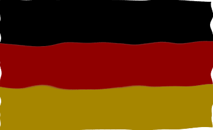 Regensburg &nbsp;·&nbsp; issues and pull requests welcome</sub>


</div>
