<div align="center">


<a href="https://github.com/Nuklaso?tab=repositories"></a>
<a href="https://github.com/Nuklaso/2048byNiklas"></a>


</div>


<table>
<tr>
<td width="33%" valign="top">

**`now`**

Pushing a pure-Python 2048 AI as far as it goes. Bitboards, expectimax, lookup tables — the kind of optimisation you only appreciate once the naive version takes a second per move.

</td>
<td width="33%" valign="top">

**`next`**

Better pruning and a faster evaluation, so the search can go deeper inside the same time budget. After that: a headless benchmark suite that runs on every push.

</td>
<td width="33%" valign="top">

**`ask me about`**

Why a 64-bit integer makes a better game board than a 2D list, how a transposition table pays for itself, and why the GUI is still the hardest part.

</td>
</tr>
</table>




> **That board is not a mockup.** It is a real game, replayed frame by frame.
> [`render_game.py`](.github/scripts/render_game.py) downloads [`engine.py`](https://github.com/Nuklaso/2048byNiklas/blob/main/engine.py)
> straight from the project, plays a full headless game with seed `11`, and freezes every
> board state into the SVG above. That run ended on **2,633 moves, 57,920 points and a 4096 tile** —
> in plain CPython, with nothing imported that does not ship with the language.

```bash
python .github/scripts/render_game.py --seed 11    # play a new game, redraw the card
```


| | PROJECT | WHAT IT DOES | STACK |
|:--|:--|:--|:--|
| `▸` | **[2048byNiklas](https://github.com/Nuklaso/2048byNiklas)** | 2048 with an expectimax AI on a 64-bit bitboard. Precomputed move tables for all 65,536 rows, transposition table, probability-cutoff pruning, adaptive depth. Ships with a tkinter GUI, a headless simulator and a self-test against a naive reference. | `Python` `Tkinter` |
| `▸` | **[ZEUKU-Maxxing](https://github.com/Nuklaso/ZEUKU-Maxxing)** | Keeps a machine awake. Anti-idle tool with a GUI, launcher scripts and a one-click `.exe` build. | `Python` `Batch` |
| `▸` | **[How-to-get-Rickrolled](https://github.com/Nuklaso/How-to-get-Rickrolled)** | A complete, straight-faced tutorial on rickrolling yourself in Windows PowerShell. Beginner and advanced editions. | `PowerShell` `Docs` |


<div align="center">

### `06 · CONTRIBUTION SNAKE`

<picture>
  <source media="(prefers-color-scheme: dark)" srcset="https://raw.githubusercontent.com/Nuklaso/Nuklaso/output/snake-dark.svg"/>
  <source media="(prefers-color-scheme: light)" srcset="https://raw.githubusercontent.com/Nuklaso/Nuklaso/output/snake.svg"/>
  
</picture>

</div>

<details>
<summary><b>&nbsp;▸&nbsp; how this profile is built</b></summary>
<br/>

Every graphic on this page is drawn by this repository. No banner generator, no stats-card
service that can rate-limit itself into a broken image.

| FILE | WHAT IT DRAWS |
|:--|:--|
| [`assets/hero.svg`](assets/hero.svg) | Hand-written SVG. The wordmark is seven `<path>` glyphs, not a font. |
| [`assets/whoami.svg`](assets/whoami.svg) | The terminal types itself with animated `clipPath` widths — no JavaScript, none allowed. |
| [`render_game.py`](.github/scripts/render_game.py) | Downloads the 2048 engine, plays a real game, samples ~100 boards into one animated SVG. |
| [`gen_profile_svgs.py`](.github/scripts/gen_profile_svgs.py) | Stats, language donut and contribution heatmap, straight from the GitHub API. Standard library only. |
| [`profile.yml`](.github/workflows/profile.yml) | Re-renders the telemetry every six hours and commits it back. |
| [`snake.yml`](.github/workflows/snake.yml) | Generates the snake above. |

</details>

<div align="center">

### `07 · CONNECT`

<a href="https://github.com/Nuklaso"></a>
<a href="https://github.com/Nuklaso?tab=repositories"></a>
<a href="https://github.com/Nuklaso/2048byNiklas"></a>

<sub>made in  Regensburg &nbsp;·&nbsp; issues and pull requests welcome</sub>


</div>
