<table>
<tr>
<td width="33%" valign="top">

**`now`**

Building small Python tools end to end — engine, GUI, tests, packaging. If it runs on my machine, I want it to run on yours too.

</td>
<td width="33%" valign="top">

**`learning`**

Search and heuristics, cleaner architecture, and everything between a script and an actual product.

</td>
<td width="33%" valign="top">

**`ask me about`**

2048 solvers, automating the boring parts of Windows, and why the GUI is always the hardest part.

</td>
</tr>
</table>

| | PROJECT | WHAT IT DOES | STACK |
|:--|:--|:--|:--|
| `▸` | **[2048byNiklas](https://github.com/Nuklaso/2048byNiklas)** | A 2048 AI. Separate game engine, playable GUI and a self-test harness, so the solver can be judged on results instead of vibes. | `Python` `Tkinter` `Search` |
| `▸` | **[ZEUKU-Maxxing](https://github.com/Nuklaso/ZEUKU-Maxxing)** | Keeps a machine awake. Anti-idle daemon with a GUI, launcher scripts and a one-click `.exe` build. | `Python` `Batch` `PyInstaller` |
| `▸` | **[How-to-get-Rickrolled](https://github.com/Nuklaso/How-to-get-Rickrolled)** | A complete, straight-faced tutorial on rickrolling yourself in Windows PowerShell. Beginner and advanced editions. | `PowerShell` `Docs` |

Every card above is drawn by [`gen_profile_svgs.py`](.github/scripts/gen_profile_svgs.py) straight from the GitHub API and refreshed by [a scheduled Action](.github/workflows/profile.yml) — no third-party card service that can rate-limit itself into a broken image.

### `07 · CONTRIBUTION SNAKE`

<picture>
  <source media="(prefers-color-scheme: dark)" srcset="https://raw.githubusercontent.com/Nuklaso/Nuklaso/output/snake-dark.svg"/>
  <source media="(prefers-color-scheme: light)" srcset="https://raw.githubusercontent.com/Nuklaso/Nuklaso/output/snake.svg"/>
  
</picture>

### `08 · CONNECT`

made in  Regensburg &nbsp;·&nbsp; issues and pull requests welcome

